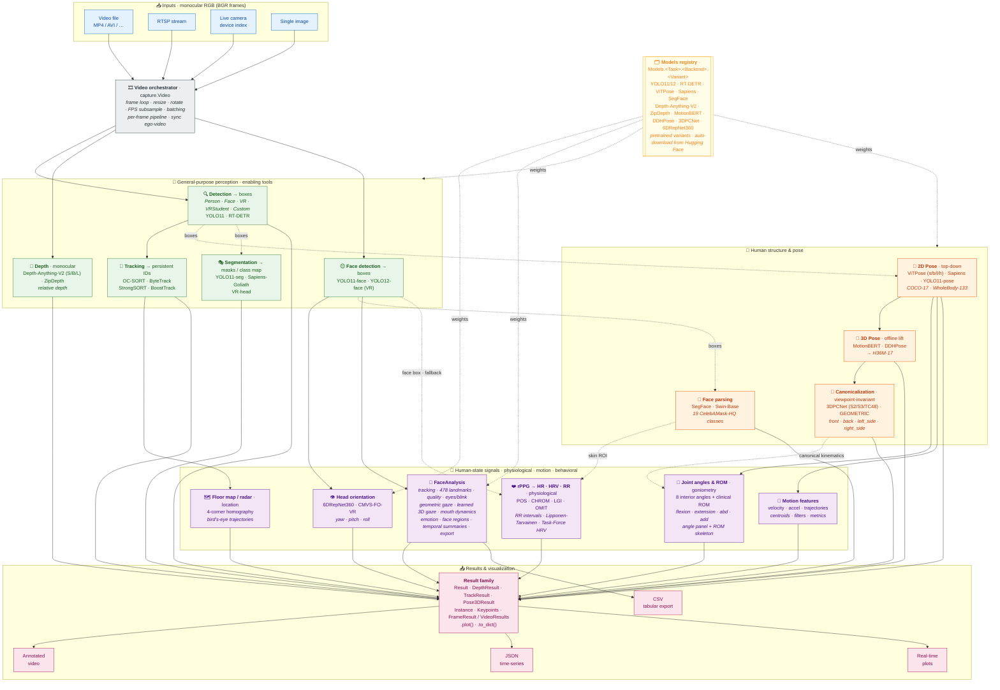
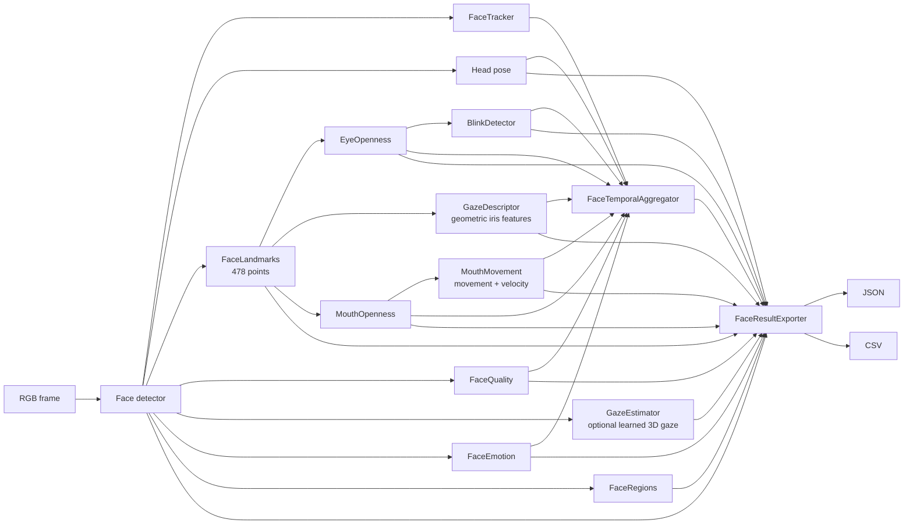

<div align="center">

# Physiotrack

**Contactless human understanding: turning pixels into interpretable physiological and behavioral signals.**

[](https://www.gnu.org/licenses/gpl-3.0)
[](https://www.python.org/downloads/)
[](https://pytorch.org/)

[](https://tharindu326.github.io/physiotrack/)

📖 **[Full documentation & API reference](https://tharindu326.github.io/physiotrack/)**

[Why Physiotrack](#why-physiotrack) ·
[Architecture](#architecture) ·
[Install](#installation) ·
[Quick start](#quick-start) ·
[Subsystems](#subsystem-guide) ·
[Models](#model-registry) ·
[Limitations](#scope--limitations) ·
[Citations](#citations)

</div>

---

**Physiotrack** is an open-source Python toolkit for contactless human understanding. It integrates
state-of-the-art computer-vision models (YOLO11, RT-DETR, ViTPose, Sapiens, Depth-Anything-V2,
ZipDepth, MotionBERT, 6DRepNet360, SegFace) together with a modular **face-analysis pipeline**
for face tracking, landmarks, quality descriptors, eye and blink analysis, geometric and learned
gaze estimation, mouth dynamics, facial emotion, face-region analysis, temporal aggregation, and
structured numerical export. These components are exposed through a **single, unified API** that
extracts actionable, theory-linked signals from ordinary **RGB video**, for healthcare, education,
XR, and operator-support systems. Developed at the **Center for Machine Vision and Signal
Processing (CMVS), University of Oulu**.

<div align="center">

[](https://youtu.be/DFVYfZCk3t4)

▶️ **[Watch the demo on YouTube](https://youtu.be/DFVYfZCk3t4)**

</div>

### Example outputs

<div align="center">


<sub>Full pipeline on one frame of a person in VR walking in a lab: tracked whole-body pose with a persistent id, live joint-angle &amp; clinical-ROM panels, the ROM skeleton, the wrist-motion plot, and colorized <i>relative</i> monocular depth. Respiration here comes from shoulder motion, reusing the pose keypoints.</sub>

<br/><br/>


<sub>Contactless rPPG on an RGB face recording: one SegFace pass yields the face parsing and skin ROI that drive the live blood-volume-pulse signal and the derived heart rate (78.0 bpm at &minus;0.1 dB SNR here). Regenerate with <code>examples/evaluation/rppg_figure.py</code>.</sub>

</div>

## Why Physiotrack?

Foundational models are good at labeling *what* they see. Physiotrack is designed to help systems
understand *what it means*. It converts an ordinary RGB video stream into interpretable
human-state features: pose and motion patterns, posture symmetry, head orientation, eye and blink
behavior, geometric and learned gaze, mouth activity, facial emotion, face-region and quality
descriptors, and rPPG-derived heart rate, heart-rate variability (HRV) and respiration rate.

The philosophy is simple: **"send meaning, not pixels"**, so downstream AI agents can reason about
human *states* instead of processing raw video.

---

## Table of Contents

- [Architecture](#architecture)
- [Key Features](#key-features)
- [Installation](#installation)
- [Quick Start](#quick-start)
- [The Unified API](#the-unified-api)
- [Subsystem Guide](#subsystem-guide)
- [Model Registry](#model-registry)
- [Result Objects](#result-objects)
- [Face-analysis validation & reproducibility](#face-analysis-validation--reproducibility)
- [Scope & Limitations](#scope--limitations)
- [Project Layout](#project-layout)
- [Citations](#citations)
- [Contributing](#contributing)
- [License](#license)
- [Authors & Acknowledgments](#authors)

---

## Architecture

Physiotrack is organized into **independent, composable subsystems**. Each one works standalone
through the same `predict()` API, and the `Video` orchestrator wires them into an end-to-end
pipeline. Every neural backend is resolved on demand through the **`Models` registry**, which
auto-downloads weights from Hugging Face.

The modules group into three tiers that mirror the *"send meaning, not pixels"* pipeline:
**🧰 enabling tools** (generic CV) → **🧍 human structure** (pose & kinematics) → **📡 human-state
signals** (the interpretable payload). The modular `FaceAnalysis` pipeline extends the face path
with per-face behavioral and temporal descriptors while remaining independently configurable.



**Reading the diagram:** read it as *pixels → tools → human structure → signals*.
**🧰 Enabling tools** (detection, tracking, segmentation, depth, face detection) localize and parse
the image; **🧍 human structure** (2D/3D pose, canonicalization, face parsing) turns those into
body-specific estimates; **📡 human-state signals** include rPPG HR/RR, **joint angles & clinical
ROM**, motion, head orientation, modular facial behavior, gaze, and location. `FaceAnalysis`
extends the face path with configurable per-face tracking, landmarks, quality, eye/blink,
geometric and learned gaze, mouth, emotion, face-region, temporal, and export operations.

Solid arrows show the principal data flow. Dotted arrows show supporting relationships such as
detection boxes feeding pose/segmentation, skin regions feeding rPPG, canonical pose feeding the
angles, and model weights supplied by the registry. Every module also works standalone. Inputs are
**monocular RGB** (BGR frames) via OpenCV. Depth is *estimated* monocularly rather than sensed:
there is no RGB-D, infrared or thermal capture path. Where a clip comes from an RGB-D camera, only
its colour stream is used.

---

## Key Features

| Subsystem | What it does | Backends |
|-----------|--------------|----------|
| **Detection** | Multi-person / object boxes with confidences | YOLO11, RT-DETR, VR-specific |
| **Tracking** | Persistent IDs across frames, occlusion-robust | OC-SORT, ByteTrack, StrongSORT, BoostTrack |
| **Pose 2D** | Body keypoints (17 COCO or 133 whole-body) | ViTPose, Sapiens, YOLO11-Pose |
| **Pose 3D** | Lift 2D keypoints to 3D over time | MotionBERT, DDHPose |
| **Canonicalization** | Viewpoint-invariant 3D pose alignment | 3DPCNet, geometric |
| **Segmentation** | Pixel-level instance masks | YOLO-Seg, Sapiens, VR-Head |
| **Face parsing** | Face-part segmentation (19 classes) | SegFace (Swin-Base) |
| **Depth** | Monocular dense depth estimation | Depth-Anything-V2 (s/b/l), ZipDepth (base/npu) |
| **Face analysis** | Face detection and tracking, head pose, 478 landmarks, quality descriptors, eye openness, blink events, geometric gaze, learned 3D gaze, mouth openness/motion, emotion, face regions, temporal summaries, JSON/CSV export | YOLO-Face, MediaPipe Face Landmarker, 6DRepNet360 / CMVS-FO-VR, ptgaze (optional), EmotiEffLib, SegFace |
| **Signals** | rPPG heart rate, HRV, respiration + motion features | POS, CHROM, LGI, OMIT; RR intervals; Lipponen-Tarvainen artefact correction; Task-Force HRV |
| **Joint angles & ROM** | 8 anatomical joint angles + clinical range-of-motion (flexion/extension/abduction/adduction) as rows in the left-side angle panel, plus a clean full-room **skeleton canvas** | goniometry from pose |
| **Views** | Bird's-eye floor map, ego-video, depth & angle/ROM overlays | n/a |

**Inputs:** monocular RGB video — files, RTSP streams, live cameras, or single images.
**Hardware:** CPU or CUDA GPU (acceleration recommended for real-time use).

---

## Installation

**Requires Python 3.10 or newer.** Install the PyTorch build that matches your platform first,
then the package:

```bash
git clone https://github.com/tharindu326/physiotrack.git
cd physiotrack

# CPU-only
pip install torch torchvision --index-url https://download.pytorch.org/whl/cpu

# ...or CUDA 12.8
pip install torch torchvision --index-url https://download.pytorch.org/whl/cu128

pip install -e .
```

Everything else resolves from `pyproject.toml`. Optional extras:

```bash
pip install -e ".[test]"     # test suite, including the NeuroKit2 reference implementation
pip install -e ".[docs]"     # MkDocs toolchain
pip install -e ".[pose3d]"   # smplx, for 3D mesh rendering in Pose3D
pip install -e ".[gaze]"     # ptgaze 0.3.0, for learned 3D gaze estimation
```

| | Supported |
| --- | --- |
| Python | 3.10, 3.11, 3.12 |
| OS | Linux, macOS, Windows |
| Hardware | CPU, or CUDA GPU (recommended for real-time use) |

Model weights are **not** bundled; they download automatically on first use through the
[`Models` registry](#model-registry) (Ultralytics weights via `ultralytics`, everything else from
Hugging Face).

#### Where weights are cached

Checkpoints are cached **outside** the installed package, so a read-only or containerised install
works, Docker layer caching is not defeated by a multi-gigabyte write into `site-packages`, and
several environments can share one download:

| | Location |
| --- | --- |
| `$PHYSIOTRACK_HOME` set | `$PHYSIOTRACK_HOME/weights` |
| `$XDG_CACHE_HOME` set | `$XDG_CACHE_HOME/physiotrack/weights` |
| Linux (default) | `~/.cache/physiotrack/weights` |
| macOS | `~/Library/Caches/physiotrack/weights` |
| Windows | `%LOCALAPPDATA%\physiotrack\weights` |

```bash
export PHYSIOTRACK_HOME=/shared/physiotrack   # share one cache across envs or containers
```

> **Upgrading from before 1.1?** Older versions downloaded into the package directory. Run
> `python -c "import physiotrack; physiotrack.migrate_weight_cache()"` once to move existing
> checkpoints into the cache instead of re-downloading them. Add `dry_run=True` to preview.

> **Windows / H.264:** OpenCV wheels often ship without an H.264 encoder. PhysioTrack detects
> this and falls back to MPEG-4 with a warning, so exports never fail silently — but for H.264
> output run `python install_openh264.py` once to place the OpenH264 runtime library.

### Testing

```bash
pip install -e ".[test]"
pytest
```

The suite validates the biomedical DSP against closed-form definitions and synthetic signals with
known ground truth, and cross-checks the HRV, artefact-correction and pulse-peak paths against
NeuroKit2 as an independent reference implementation. It must pass with **zero skips**:
`neurokit2` is part of the `test` extra precisely so those cross-checks cannot skip silently and
leave the strongest correctness claim unverified.

---

## Quick Start

```python
import cv2
import physiotrack as pt

frame = cv2.imread("examples/IMG_0121.mp4")  # or any BGR frame you have

# Detect people
det    = pt.Detection.Person(conf=0.25, device=0)
result = det.predict(frame)          # -> Result
cv2.imwrite("out.png", result.plot())

# Whole-body 2D pose (auto-detects people if no boxes given)
pose   = pt.Pose.Person()
people = pose.predict(frame)
wrist  = people[0].keypoints.by_name("left_wrist")
print(wrist.x, wrist.y, wrist.confidence)
```

For modular facial analysis:

```python
from physiotrack.face import FaceAnalysis, FaceAnalysisConfig

config = FaceAnalysisConfig(
    tracking=True,
    head_pose=True,
    landmarks=True,
    quality=True,
    eyes=True,
    blink=True,
    gaze=True,
    gaze_estimation=False,   # set True when the optional [gaze] dependency is installed
    mouth=True,
    mouth_motion=True,
    emotion=True,
    regions=True,
    temporal=True,
)

face_pipeline = FaceAnalysis(
    config=config,
    fps=30,
)

face_result = face_pipeline.predict(frame)
```

`FaceAnalysisConfig` keeps each optional analysis path explicit. Learned gaze estimation remains
separate from the original geometric iris-position descriptor and can be enabled independently.

---

## The Unified API

Everything user-facing is reached through one flat, predictable hierarchy. Import the entry
points from the top-level `physiotrack` package or a named subsystem; you never need to reach into
internal module paths:

```text
physiotrack ─┬─ Detection.Person() / .Face() / .VR() / .VRStudent() / .Custom()
             ├─ Pose.Person() / .VRStudent() / .Custom()
             ├─ Pose3D(...) · canonicalize_pose(...) · PoseCanonicalizer
             ├─ Segmentation.Person() / .VRHead() / .BodyPart() / .Face() / .Custom()
             ├─ Depth.DepthAnythingV2Small() / Base() / Large() / .ZipDepth() / .ZipDepthNPU() / .Custom()
             ├─ Face · VRFace · FaceOrientation
             ├─ Tracker(config=TrackerConfig(...))
             ├─ Video(...)                              # end-to-end pipeline orchestrator
             ├─ Models.<Task>.<Backend>.<Variant>       # model registry (auto-download)
             └─ Result · DepthResult · TrackResult      # returned by every predictor
                          ↳ .boxes · .keypoints · .seg_map · .names · .plot() · .to_dict()

physiotrack.face ─┬─ FaceAnalysis · FaceAnalysisConfig
                  ├─ Face · VRFace · FaceOrientation
                  ├─ FaceTracker · FaceLandmarks · FaceQuality
                  ├─ EyeOpenness · BlinkDetector
                  ├─ GazeDescriptor · GazeEstimator
                  ├─ MouthOpenness · MouthMovement
                  ├─ FaceEmotion · FaceRegions
                  ├─ FaceTemporalAggregator · FaceResultExporter
                  └─ drawing helpers (draw_axis, plot_pose_cube)

physiotrack.signals ─┬─ compute (plotter-free, use directly):
                     │    joint_angles() · compute_rom_angles() · motion features · respiration_from_motion()
                     │    rPPG: POS/CHROM/LGI/OMIT · HeartRateEstimator · bvp_to_hr · bvp_snr
                     │    pulse analysis: bvp_to_rri · correct_rr_artifacts · compute_hrv · respiration_from_pulse/rri
                     │    filters · agreement metrics (Pearson, RMSE, DTW, hrv_errors, …)
                     └─ overlays (optional, wrap the compute above):
                          JointAnglePlotter · RPPGPlotter · HeartRatePlotter · HRVPlotter · RespirationPlotter · KeypointMotionPlotter

physiotrack.pose ── keypoint name maps (COCO_WHOLEBODY_NAMES, HUMAN26M_NAMES)
```

Every image predictor (`Detection`, `Pose`, `Segmentation`, `Depth`, `Face`) follows the same
pattern (modeled on Ultralytics / MediaPipe / scikit-learn):

```python
model  = pt.Detection.Person(conf=0.25, iou=0.45, device=0)   # 1. configure the MODEL
result = model.predict(image)                                 # 2. predict  (or: model(image))
data   = result.boxes                                         # 3. read structured data
frame  = result.plot()                                        # 4. draw the overlay
```

Three rules make the whole library predictable:

1. **One verb.** Every predictor exposes `.predict(img)` and is callable. Batch with a list:
   `predict([img, img, ...]) -> list[Result]`.
2. **One return type.** Every predictor returns a rich `Result` object rather than tuples in mixed
   orders.
3. **Rendering lives on the result, not the model.** `result.plot(...)` draws the overlay;
   constructors only configure the model.

---

## Subsystem Guide

<details open>
<summary><b>Detection</b></summary>

```python
from physiotrack import Detection, Models

det = Detection.Person()                       # also .Face() .VR() .VRStudent()
result = det.predict(image)
print(result.boxes)                            # (N, 4)

for inst in result:
    print(inst.box, inst.confidence, inst.cls_name)

det = Detection.Custom(model=Models.Detection.YOLO.VR.m_vr)
```

</details>

<details>
<summary><b>Pose estimation (2D)</b></summary>

```python
from physiotrack import Pose, Models

pose = Pose.Person()
result = pose.predict(image)
print(result.architecture)                     # "WHOLEBODY" or "COCO"

for person in result:
    wrist = person.keypoints.by_name("left_wrist")
    if wrist:
        print(wrist.x, wrist.y, wrist.confidence)

pose = Pose.Custom(model=Models.Pose.ViTPose.WholeBody.l_wholebody)
```

- **COCO**: 17 keypoints (body only).
- **WholeBody**: 133 keypoints (body + hands + face).
- When no bounding boxes are supplied, the pose estimator detects people with the default
  detector.

</details>

<details>
<summary><b>Pose 3D &amp; canonicalization</b></summary>

```python
from physiotrack import Models, Pose, Pose3D, Video, canonicalize_pose

results = Video(source="clip.mp4", pose=Pose.Person()).run()

p3d = Pose3D(
    model=Models.Pose3D.MotionBERT.mb_ft_h36m_global_lite,
    device="cpu",
)
poses = p3d.predict(results, fps=30)
poses.by_name("left_wrist")

canonical = canonicalize_pose(
    poses.poses,
    view="front",
)

canonical = canonicalize_pose(
    poses.poses,
    model=Models.Pose3D.Canonicalizer.Models._3DPCNetTC48_byCam,
    view="front",
)
```

> Lifting is **sequence-level** (a temporal model needs a window of 2D frames per 3D frame) and
> single-subject. Coordinates are root-relative, not metric.

</details>

<details>
<summary><b>Segmentation &amp; Depth</b></summary>

```python
from physiotrack import Segmentation, Depth

seg = Segmentation.Person()
seg_map = seg.predict(image).seg_map

# Face parsing (SegFace, 19 face-part classes).
parse = Segmentation.Face()
result = parse.predict(image)
seg_map = result.seg_map
annotated = result.plot()

depth = Depth.DepthAnythingV2Base()
d = depth.predict(image)
raw, colored = d.depth, d.plot(colormap="inferno")
```

</details>

<details>
<summary><b>Face detection &amp; head orientation</b></summary>

```python
from physiotrack import VRFace, FaceOrientation, Models

face = VRFace()
boxes = face.predict(image).boxes

orient = FaceOrientation(
    model=Models.Pose3D.FaceOrientation.VR,
)

for inst in orient.predict(image, boxes):
    print(inst.orientation)
```

</details>

<details>
<summary><b>Modular face analysis</b></summary>

The `physiotrack.face` subsystem provides a configurable `FaceAnalysis` orchestrator on top of the
individual face components. The face detector remains the primary localization stage; the
remaining analysis modules can be enabled or disabled independently through `FaceAnalysisConfig`
subject to their explicit dependencies.

```python
from physiotrack.face import FaceAnalysis, FaceAnalysisConfig

config = FaceAnalysisConfig(
    tracking=True,
    head_pose=True,
    landmarks=True,
    quality=True,
    eyes=True,
    blink=True,
    gaze=True,
    gaze_estimation=False,
    mouth=True,
    mouth_motion=True,
    emotion=True,
    regions=True,
    temporal=True,
)

pipeline = FaceAnalysis(
    config=config,
    fps=30,
)

result = pipeline.predict(frame)

for face in result:
    print(face.id, face.box)
```

The current modular stack includes:

- **Face detection** for per-frame facial localization.
- **FaceTracker** for persistent per-face identities across video frames.
- **FaceLandmarks** for 478-point facial landmarks.
- **FaceQuality** for detector confidence, normalized grayscale brightness,
  Laplacian-variance sharpness, and face-area ratio.
- **EyeOpenness** for continuous left/right/mean eye-openness measurements.
- **BlinkDetector** for temporal blink state, events, duration, count, and rate.
- **GazeDescriptor** for the original landmark/iris-based geometric gaze descriptor.
- **GazeEstimator** for learned normalized 3D gaze vectors with pitch/yaw angles through the
  optional `ptgaze` backend.
- **MouthOpenness** for continuous normalized mouth opening.
- **MouthMovement** for temporal mouth movement and velocity.
- **FaceEmotion** for eight-class emotion scores, predicted label, and confidence.
- **FaceRegions** for semantic face-region outputs.
- **FaceTemporalAggregator** for per-person sliding-window summaries.
- **FaceResultExporter** for structured frame/window JSON and CSV export.

The geometric gaze descriptor and learned `GazeEstimator` intentionally remain separate because
they represent different quantities. The former describes normalized iris position, whereas the
latter estimates a learned 3D gaze direction.

`FaceAnalysisConfig` validates important component dependencies. In the current pipeline:

- eye openness requires landmarks;
- blink detection requires eye openness;
- geometric gaze requires landmarks;
- mouth openness requires landmarks;
- mouth motion requires mouth openness;
- temporal aggregation requires tracking.

Learned gaze estimation is optional and is disabled by default. Enable it after installing the
`gaze` extra:

```bash
pip install -e ".[gaze]"
```

Then configure:

```python
config = FaceAnalysisConfig(
    gaze_estimation=True,
    gaze_estimation_mode="eth-xgaze",
    gaze_estimation_min_iou=0.10,
)
```

### Face-analysis data flow



Static images support the non-temporal face-analysis components. Tracking-dependent measurements
such as blink-event timing, mouth movement/velocity, and temporal-window summaries require a
sequence with valid frame timing. These temporal quantities should not be synthesized for an
independent image.

</details>

<details>
<summary><b>Signals: rPPG / heart rate / HRV / respiration &amp; motion</b></summary>

The computation is **plotter-free** — use it directly; the overlay is an optional wrapper.

```python
from physiotrack.signals import POS, bvp_to_hr, bandpass_filter
from physiotrack.signals import FaceSkinExtractor, HeartRateEstimator

# Low level: one rPPG method on an RGB skin trace, shape (3, N) with rows R, G, B
bvp   = POS(fps=30).apply(rgb_trace)
clean = bandpass_filter(bvp, 0.75, 4.0, 30)
hr_bpm, times = bvp_to_hr(clean, fps=30)
latest = hr_bpm[-1]

# High level: SegFace face parsing -> rPPG on the skin
fs  = FaceSkinExtractor()
est = HeartRateEstimator("POS", fps=30, window_sec=60)

mask, skin_canvas = fs.extract(frame)
est.update(frame, roi_mask=mask)

print(est.hr, est.snr)
print(est.hrv())
print(est.respiration_rate())
```

Or step through the pulse-analysis chain explicitly:

```python
from physiotrack.signals import bvp_to_rri, correct_rr_artifacts, compute_hrv

rri_ms, _ = bvp_to_rri(clean, fps=30)
rri_ms, _ = correct_rr_artifacts(rri_ms)
hrv = compute_hrv(rri_ms)
```

`update` also accepts a face `box` as a lightweight fallback when segmentation is not used.

For on-frame overlays, wrap a shared estimator with `RPPGPlotter`, `HeartRatePlotter`,
`HRVPlotter` and `RespirationPlotter`. All read the same `HeartRateEstimator`, so the rPPG is
computed once.

See [`examples/rppg_vitals.py`](examples/rppg_vitals.py), or enable the corresponding outputs in
the video pipeline. Respiration also has a pose-based route (`respiration_from_motion`) that can
cross-check the rPPG-derived estimate.

</details>

<details>
<summary><b>Joint angles &amp; clinical ROM (goniometry)</b></summary>

Two kinds of angle, both derived from pose keypoints:

- **Interior joint angles** — 8 anatomical angles (left/right **shoulder, elbow, hip, knee**), the
  angle *at* each joint.
- **Clinical range-of-motion (ROM)** — named physiotherapy movements such as hip flexion,
  extension, abduction and adduction, measured against a body reference axis.

The measurement is **plotter-free**:

```python
import physiotrack as pt

from physiotrack.signals import (
    joint_angles,
    compute_rom_angles,
    JointAnglePlotter,
)

det = pt.Pose.Person().predict(frame).to_dict()["instances"]
kps = det[0]["keypoints"]

joint_angles(kps)
compute_rom_angles(kps)

plotter = JointAnglePlotter(rom=True)
plotter.update(result.to_dict()["instances"], frame_time=t)
frame = plotter.attach_to_frame(frame, position="top_left")
```

In the `Video` pipeline, `plot_angles=True` shows the interior joint-angle grid; `rom=True`
(or a list of selected movements) adds the clinical ROM grid and skeleton visualization.
`rom_render=False` keeps the numerical ROM values while hiding the skeleton panel.

</details>

<details>
<summary><b>Tracking &amp; full video pipeline</b></summary>

```python
from physiotrack import Tracker, TrackerConfig, Video, Pose, Detection, Models

tracker = Tracker(
    config=TrackerConfig(
        tracker="ocsort",
        classes=[0],
    )
)

video = Video(
    source="input.mp4",
    detector=Detection.Person(),
    pose=Pose.Custom(
        model=Models.Pose.ViTPose.WholeBody.b_wholebody,
    ),
    tracker=tracker,
    output_dir="output",
)

data = video.run(
    output_video="out.mp4",
    output_json="out.json",
)
```

The `Video` orchestrator composes any subset of the whole-body pipeline. Besides `detector=`,
`pose=` and `tracker=`, it accepts segmentation, depth, face orientation, floor-map, ego-video,
motion and kinematic visualization options.

Phone clips often decode sideways or upside-down because rotation is stored as metadata rather
than in the pixels. Pass `orient=90/180/270` to rotate every frame upright; the default
`orient=0` leaves frames unchanged.

</details>

---

## Model Registry

All weights are addressed through the `Models` registry and auto-downloaded on first use:

```python
from physiotrack import Models

Models.Detection.YOLO.FACE.m_face
Models.Detection.RTDETR.PERSON.x_person
Models.Pose.ViTPose.WholeBody.b_wholebody
Models.Pose.Sapiens.WholeBody.B1_TS_COCOHB
Models.Segmentation.SegFace.Face.swinb_celeba_512
Models.Depth.DepthAnythingV2.vitb
Models.Depth.ZipDepth.base
Models.Pose3D.MotionBERT.mb_ft_h36m
Models.Pose3D.Canonicalizer.Models._3DPCNetS2
Models.Pose3D.FaceOrientation.VR
```

The modular face-analysis subsystem also uses the current face detector, MediaPipe face landmark
model, SegFace-based face-region analysis, EmotiEffLib-based facial emotion inference, and—when
the `gaze` extra is installed—the `ptgaze` learned gaze backend. The learned gaze path remains
separate from the original geometric `GazeDescriptor`.

### Pose framework comparison

| Framework | Variants | Keypoints | Notes |
|-----------|----------|-----------|-------|
| YOLO-Pose | COCO | 17 | Fast, integrated detection + pose |
| ViTPose | COCO, WholeBody | up to 133 | Transformer-based, high accuracy |
| Sapiens | WholeBody | 133 | State-of-the-art whole-body estimation |

### Canonicalization models (3DPCNet)

The pose canonicalizer maps an arbitrary-viewpoint 3D pose to a **viewpoint-invariant canonical
form**, so downstream kinematic analysis is robust to camera placement. Two model families are
released; select one according to the deployment scenario, or use `GEOMETRIC` for a training-free
closed-form baseline.

| Registry member | Training data | Test split | MPJPE ↓ | PA-MPJPE ↓ | Rot. err ↓ |
|-----------------|---------------|------------|:------:|:----------:|:----------:|
| `_3DPCNetS2` | MMFi | TotalCapture (cross-dataset) | 49.4 | 38.5 | 4.47° |
| `_3DPCNetS3` | MMFi | TotalCapture (cross-dataset) | 48.4 | 37.1 | 4.20° |
| `_3DPCNetTC48_byCam` | TotalCapture (48 augmented cams) | held-out cams 41–48 | **44.1** | **27.6** | **0.45°** |
| `_3DPCNetTC48_byAction` | TotalCapture (48 augmented cams) | held-out action (rom3) | 46.2 | **27.6** | 1.24° |

> MPJPE / PA-MPJPE in mm, rotation error in degrees (lower is better), reported on the
> TotalCapture test set. `S2` / `S3` are two split configurations of the MMFi-trained model;
> `TC48_byCam` / `TC48_byAction` are trained directly on TotalCapture with 48 augmented camera
> angles and use camera- vs. action-disjoint test splits.

### Model formats

- **Sapiens**: TorchScript `.pt2` (optimized inference)
- **ViTPose**: PyTorch `.pth` weights + matching config
- **YOLO / RT-DETR**: native format with built-in config

---

## Result Objects

| Task | Returns | Key attributes |
|------|---------|----------------|
| detect / pose / segment / face | `Result` | `.boxes`, `.instances`, `.keypoints`, `.seg_map`, `.architecture`, `.meta`, `.plot()`, `.to_dict()`, `.from_dict()` |
| modular face analysis | `Result` with per-face analysis features | face ID/box plus enabled head-pose, landmark, quality, eye/blink, gaze, mouth, emotion, region, and temporal outputs |
| face-analysis export | JSON / CSV records through `FaceResultExporter` | frame-level and temporal-window numerical outputs |
| depth | `DepthResult` | `.depth`, `.normalized()`, `.plot(colormap=...)` |
| track | `TrackResult` | `.instances`, `.ids`, `.boxes`, `.plot(frame)` |
| 3D lift (`Pose3D`) | `Pose3DResult` | `.poses` `(N,17,3)`, `.by_name(joint)`, `.fps`, `.view`, indexable/iterable by frame |
| `Video.run()` | `VideoResults` of `FrameResult` | per frame: `.meta`, `.vitals`, `.hr`, `.snr`, iterates its `Instance`s; `.to_json()` |

Each `Instance` exposes `.id`, `.box`, `.confidence`, `.cls` / `.cls_name`, `.keypoints`
(a `Keypoints` collection with `.by_name()` / `.by_id()`), `.mask`, and `.orientation` as
applicable. `Keypoints` also offers the array views `.xy`, `.xyz`, and `.conf`.

Every result carries a `.meta` recording where it came from — frame index, timestamp, source frame
rate, model, device — and supports dictionary serialization so saved numerical outputs can remain
traceable to the processing context.

---

## Face-analysis validation & reproducibility

The face-analysis branch includes dedicated validation packages under `validation/` for
component-level scientific evaluation, isolated real-pipeline execution, integration testing,
runtime characterization, and controlled robustness analysis.

The validation coverage includes:

- face detection;
- face tracking;
- facial landmarks;
- face-region segmentation;
- head pose;
- eye openness and blink behavior;
- geometric gaze descriptors;
- learned 3D gaze estimation;
- mouth openness;
- mouth movement and velocity;
- facial emotion recognition;
- FaceQuality descriptors;
- temporal aggregation;
- native JSON/CSV export;
- multi-person association;
- static-image execution;
- end-to-end `FaceAnalysis` integration;
- runtime / processing-performance characterization;
- controlled image-perturbation robustness testing.

The validation methodology distinguishes between different forms of evidence:

- **Component benchmark validation** evaluates predictive or numerical performance against an
  external reference or controlled ground truth when an appropriate benchmark exists.
- **Isolated component execution** verifies that the current production component operates through
  the real `FaceAnalysis` pipeline and produces genuine numerical outputs.
- **Integration validation** verifies coexistence, configuration behavior, per-person association,
  temporal state, native export, static-image handling, multi-person execution, and complete
  pipeline operation.
- **Runtime evaluation** characterizes processing performance and does not constitute an accuracy
  metric.
- **Controlled robustness evaluation** characterizes deterministic behavior under defined image
  perturbations and is not a universal population-level robustness claim.

Integration availability must not be interpreted as predictive accuracy. A component producing a
valid output for every evaluated face means that the software path was operational on that fixture;
scientific accuracy remains established by the corresponding component-specific benchmark or
controlled validation protocol.

The validation scripts use repository-relative paths and keep benchmark datasets read-only.
Final validation packages preserve numerical result tables, summaries, figures, qualitative
evidence, and reproducible execution scripts.

---

## Scope & Limitations

**PhysioTrack is research software. It is not a medical device**, has not been evaluated by any
regulatory body, and must not be used for diagnosis, screening, triage, or treatment decisions.
Read the following before relying on any number it produces.

**Input.** Monocular **RGB** video only. There is no RGB-D, infrared, or thermal capture path;
depth is *estimated* from colour frames, not sensed.

**Heart rate (rPPG).** Requires adequate, stable lighting, visible facial skin, and limited
subject motion. Accuracy degrades with motion, illumination change, video compression, and low
frame rate, and rPPG is known to be sensitive to skin tone. Always interpret a heart rate
alongside its `snr` — a value is reported whenever the analysis window is full, regardless of
signal quality.

**HRV is not validated.** Heart-rate variability is far more demanding than heart rate: the heart
rate is a spectral peak and tolerates a mis-detected beat, whereas every HRV index is built from
the intervals *between* beats, so one missed or spurious beat distorts it. The frequency-domain
indices need **at least 60 s** of clean pulse. PhysioTrack computes HRV and warns when the
beat-derived rate disagrees with the spectral rate, but **we make no accuracy claim for HRV** —
treat it as exploratory until validated against a contact reference on your own data.

**Depth is relative, not metric.** Larger means nearer, on an arbitrary scale that is not
comparable between frames. There is no camera calibration or metric scale recovery.

**3D pose is monocular-lifted, not triangulated**, runs offline from a saved 2D-pose file rather
than streaming, and is single-subject: in a multi-person frame only the first subject receives 3D
keypoints.

**Kinematics are image-plane measurements.** Joint angles and range of motion come from pixel
coordinates and velocities are in pixels per second, so they are **not comparable across subjects,
camera distances, or resolutions**. Range of motion covers two geometrically distinct
measurements per hip rather than four independent clinical movements without an additional signed
convention.

**Face analysis combines heterogeneous measurements.** A valid numerical output is not, by
itself, an accuracy guarantee. The face-analysis stack includes geometric, learned, temporal, and
descriptor-based quantities that have different interpretations.

**Learned gaze estimation depends on successful face localization and association.** The learned
`GazeEstimator` is distinct from the geometric `GazeDescriptor`: one estimates normalized 3D gaze
direction, while the other describes landmark/iris geometry.

**Mouth openness is a normalized landmark-derived quantity**, not a direct physical percentage of
jaw opening. Mouth movement and velocity are temporal quantities and require ordered frames with a
known frame rate.

**FaceQuality is descriptor-based.** Detector confidence, normalized brightness,
Laplacian-variance sharpness, and face-area ratio are interpretable numerical descriptors rather
than a universal perceptual face-quality score.

**Temporal face analysis requires stable tracking and frame timing.** Independent static images
cannot provide blink-event timing, mouth velocity, or temporal-window summaries.

**Multi-person analysis needs a tracker.** Without one, instance ids are per-frame indices, so any
cross-frame quantity can mix subjects. Attach a tracker to obtain persistent identities.

**Privacy.** The library performs no anonymization. It processes identifiable faces and derives
physiological and behavioral signals from them; consent, retention, and data protection are the
responsibility of the deploying party.

---

## Project Layout

```text
src/physiotrack/
├── capture/        # Video orchestrator (end-to-end pipeline)
├── detect/         # Detection
├── pose/           # Pose 2D, Pose3D, canonicalizer, evaluation
├── segment/        # Segmentation
├── depth/          # Depth estimation
├── face/           # Modular face analysis:
│                   # detection, tracking, head pose, landmarks, quality,
│                   # eyes/blink, geometric + learned gaze, mouth dynamics,
│                   # emotion, face regions, temporal aggregation, export
├── trackers/       # OC-SORT, ByteTrack, StrongSORT, BoostTrack
├── signals/        # rPPG + RR intervals/HRV/respiration, motion,
│                   # joint angles, ROM, filters and plotting
├── core/           # inference loop, radar/floor view, ego view, depth view
├── modules/        # Neural backends (ViTPose, Sapiens, YOLO,
│                   # DepthAnythingV2, ZipDepth, MotionBERT, DDHPose,
│                   # 3DPCNet, 6DRepNet360, SegFace)
├── results.py      # Unified Result / DepthResult / TrackResult /
│                   # Instance / Keypoints
└── models.py       # Models registry + Hugging Face auto-download

validation/
├── emotion_recognition/
├── eye_openness_and_blink/
├── face_detection/
├── face_landmarks/
├── face_quality/
├── face_regions/
├── face_tracking/
├── gaze_estimation/
├── head_pose/
├── integration/
├── mouth_movement_velocity/
├── mouth_openness/
├── robustness/
└── temporal_aggregation/
```

The `validation/` tree contains the component-level benchmark packages, isolated execution
evidence, integration fixtures, quantitative tables, figures, qualitative outputs, and supporting
reproducibility documentation used for the face-analysis validation work.

See [`examples/`](examples/) for runnable scripts covering the wider Physiotrack subsystems, and
[`docs/paper/API_REDESIGN.md`](https://github.com/tharindu326/physiotrack/blob/main/docs/paper/API_REDESIGN.md)
for the public-API design specification.

---

## Citations

If you use Physiotrack in your research, please cite the relevant papers:

```bibtex
@inproceedings{ekanayake2025evaluating,
  title={Evaluating the Accuracy and Reliability of Camera-Based Physiological and Motion Signal Extraction Techniques in Virtual Reality Training Environments},
  author={Ekanayake, Tharindu and {\'A}lvarez Casado, Constantino and Nguyen, Nhi and Sobocinski, Marta and Pramila-Savukoski, Sari and Wu, Xiaoting and Mikkonen, Kristina and Bordallo L{\'o}pez, Miguel},
  booktitle={Scandinavian Conference on Image Analysis},
  pages={442--456},
  year={2025},
  organization={Springer}
}

@inproceedings{ekanayake20263dpcnet,
  title={3DPCNet: Pose Canonicalization for Robust Viewpoint-Invariant 3D Kinematic Analysis from Monocular RGB Cameras},
  author={Ekanayake, Tharindu and Casado, Constantino {\'A}lvarez and L{\'o}pez, Miguel Bordallo},
  booktitle={ICASSP 2026-2026 IEEE International Conference on Acoustics, Speech and Signal Processing (ICASSP)},
  pages={11007--11011},
  year={2026},
  organization={IEEE}
}

@article{casado2023face2ppg,
  title={Face2PPG: An unsupervised pipeline for blood volume pulse extraction from faces},
  author={Casado, Constantino Alvarez and L{\'o}pez, Miguel Bordallo},
  journal={IEEE Journal of Biomedical and Health Informatics},
  volume={27},
  number={11},
  pages={5530--5541},
  year={2023},
  publisher={IEEE}
}

@inproceedings{nguyen2025comparative,
  title={Comparative Analysis of rPPG and Motion-Based Approaches for Heart and Respiration Rate Estimation from Videos},
  author={Nguyen, Nhi and {\'A}lvarez Casado, Constantino and Nguyen, Le and Lage Ca{\~n}ellas, Manuel and Bordallo L{\'o}pez, Miguel},
  booktitle={Scandinavian Conference on Image Analysis},
  pages={32--46},
  year={2025},
  organization={Springer}
}
```

---

## Contributing

Physiotrack is an open-source project and welcomes contributions: new models, documentation,
bug fixes, or examples. Start with [CONTRIBUTING.md](CONTRIBUTING.md), which covers the
development setup, the Conventional Commits our releases are generated from, the Google-style
docstring convention the documentation is built from, and the code standards.

Then open an issue or pull request on
[GitHub](https://github.com/tharindu326/physiotrack).

<div align="center">

[](https://github.com/tharindu326/physiotrack/graphs/contributors)

</div>

Every avatar is someone who has contributed code, documentation, or fixes — the grid updates
itself from the GitHub API. If your name or avatar looks wrong, a commit used a different git
identity; add yourself to `.mailmap` and it will be consolidated everywhere.

### Reproducing the published numbers

The scripts behind the wider Physiotrack figures and benchmarks live in
[`examples/evaluation/`](examples/evaluation/), so reported values can be regenerated rather than
taken on trust:

```bash
python examples/evaluation/runtime_benchmark.py
python examples/evaluation/rppg_figure.py
python examples/evaluation/pipeline_figure.py
```

Each writes a JSON alongside its output recording the hardware, library version, and measured
values, so a number can be traced to a specific run.

The face-analysis validation packages are maintained separately under `validation/` and preserve
their own reproducible scripts, numerical results, summaries, figures, and qualitative evidence.

---

## License

Licensed under the **GNU General Public License v3.0**. See the [LICENSE](LICENSE) file for
details.

---

## Authors

**Developed by**

- M.Sc. Tharindu Ekanayake
- D.Sc. (Tech) Constantino Álvarez Casado *(PI)*

**Face-analysis thesis contribution**

- **M.Sc Mahdi Muhannad** — modular face-analysis pipeline development, component validation, integration,
  reproducibility evaluation, runtime characterization, and controlled robustness assessment.

**Affiliation**

Multimodal Sensing Lab (MMSLab) · Center for Machine Vision and Signal Processing (CMVS) ·
University of Oulu, Finland

### Acknowledgments

This research was supported by the University of Oulu and the Research Council of Finland
(former Academy of Finland) through the 6G Flagship Programme (Grant No. 346208), the Profi5 HiDyn
programme (326291), and the Profi7 Hybrid Intelligence programme (352788). The authors acknowledge
CSC (IT Center for Science, Finland) for computational resources.

---

<div align="center">

**Repository:** [github.com/tharindu326/physiotrack](https://github.com/tharindu326/physiotrack)

</div>